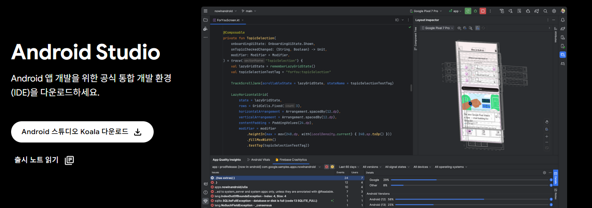
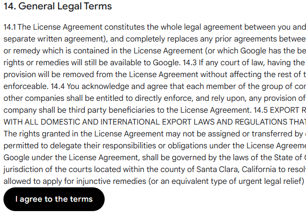
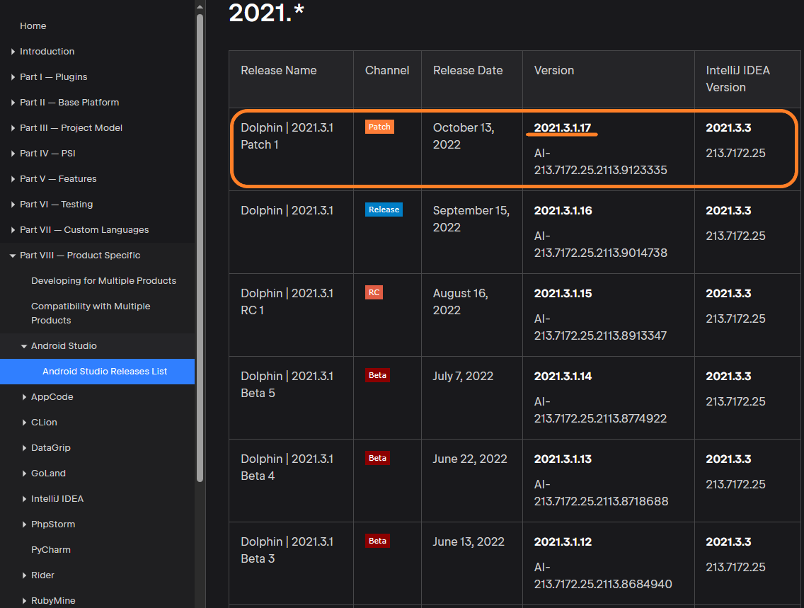
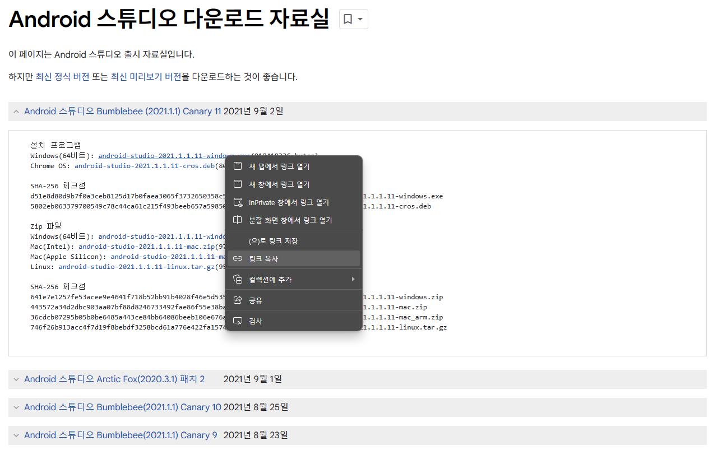
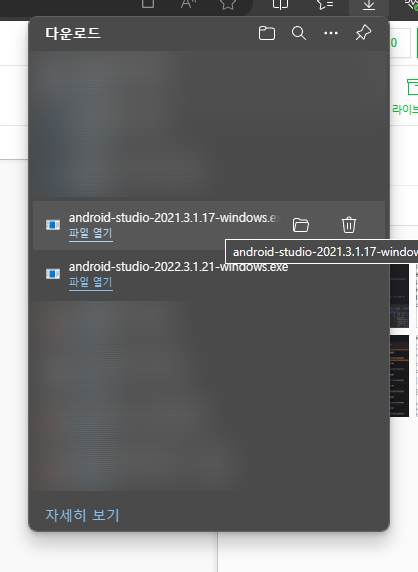

## 안드로이드 스튜디오 (Android Studio) 가 뭐야?

ios 에 Xcode 가 있다면, 안드로이드에는 `안드로이드 스튜디오` 가 있다!

`안드로이드 스튜디오` 는 말 그대로 안드로이드 전용 앱을 개발하는 도구로, 구글이 2013년에 발표한 비교적 최신 이름표를 붙이고있는 개발 플랫폼이다.

2024년 6월 25일 기준 최신버전인 안드로이드 스튜디오 `Koala` 버전은 공식 안드로이드 스튜디오 메인 홈페이지에서 다운로드가 가능하다.

> * [공식 홈페이지에서 안드로이드 설치](https://developer.android.com/studio?hl=ko)

하지만 앞으로 진행할 커리큘럼과 실습의 안정성을 위해, 또는 최신버전의 오류가 심해, 이전 버전으로 돌아가야 하는 경우가 있다.

> 안드로이드 스튜디오 프로그램 내에서는 버전의 업그레이드만 가능하다.
{: .prompt-info }

필자는 지금 `Dolphin` 버전의 안드로이드 스튜디오가 필요하기에, 이를 바탕으로 하위 버전의 설치 방법을 소개하겠다.

___

## **안드로이드 스튜디오 다운로드 자료실 접근**

일단 해당 링크에 접속한다

> * [안드로이드 스튜디오 다운로드 자료실](https://developer.android.com/studio/archive)

많은 동의 조항들이 있다. 스크롤을 쭉 내려, 자료실의 이용 약관에 동의 하자.

> 안드로이드 스튜디오 다운로드 자료실의 한국어 페이지(=ko) 로 접속시, 페이지가 없다고 나오는 경우가 있는것같다! `Switch to English` 버튼을 눌러 영어 페이지로 바꾸어주자.
{: .prompt-info }

동의를 누르면, 구글에서 제공하는 구 버전 안드로이드 스튜디오 버전을 다운받을 수 있는 목록이 나온다.

하지만, 필자가 원하는 `Dolphin` 버전은 보이지 않는다.

일단 이 창은 그대로 두자.

## **Jetbrain Release 리스트에서 필요한 버전 정보만 가져오기**

이제 다음 링크로 접속한다

> * [Jetbrain Release 리스트](https://plugins.jetbrains.com/docs/intellij/android-studio-releases-list.html#2024)

위 사이트에서는 년도별로 Release 된 안드로이드 스튜디오 리스트를 모두 확인할 수 있다.

리스트를 확인해서 필자가 필요한 `Dolphin` 버전의 마지막 릴리즈인 `2021.2.1.17`  를 찾아냈다.

이제 이 `2021.2.1.17` 을 그대로 복사한다.

## **다운로드 링크 조합하기**

이전에 띄워놨던 `안드로이드 스튜디오 다운로드 자료실`에서

**아무 버전**이나 클릭한 뒤, 다운로드 링크를 **우클릭으로 복사**한다.

이렇게 복사된 링크값

🌐 httpps://redirector.gvt1.com/edgedl/android/studio/install/`2021.1.1.11`/android-studio-`2021.1.1.11`-windows.exe

에서, `Jetbrain Release 리스트`에서 가져온 `버전 정보`로 버전 정보 부분을 바꿔 입력하면된다.

🌐 httpps://redirector.gvt1.com/edgedl/android/studio/install/`2021.3.1.17`/android-studio-`2021.3.1.17`-windows.exe

이렇게 해당 버전에 맞는 `exe` 파일이 다운로드되는것을 확인할 수 있다.

이 후에는 안드로이드 스튜디오 설치 마법사를 따라 설치를 진행하면 된다!