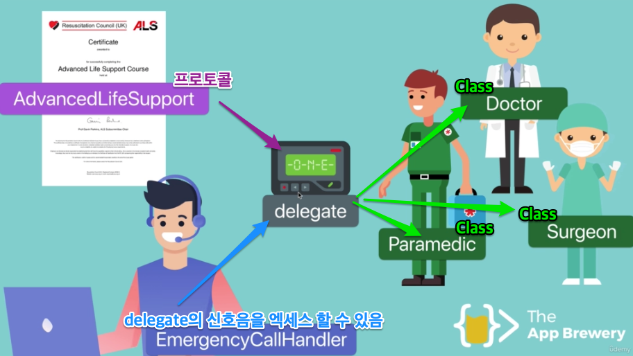
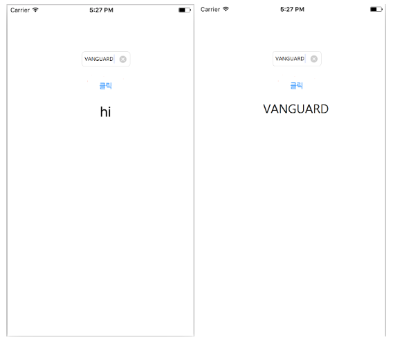
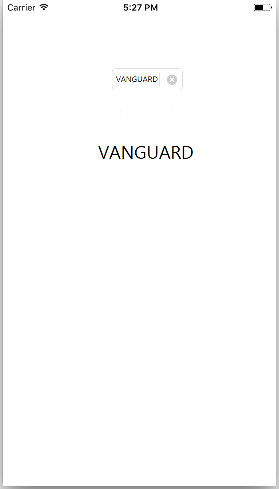

> Dele-gate [델리게이트]
>
> 1. [명사] 대표(자)
> 2. [동사] 위임하다
> 3. [타동사] (대표를) 뽑다, 선정하다

___


## **💡**개요

오늘 정리할 내용은 `델리게이트` (Delegate) 에 대한 내용입니다.

`델리게이트`의 개념 자체는 `Swift`의 개선 이전 버전인 `Object-c` 는 물론, `코틀린`  , `C#` 등 다른 언어에서도 사용되는 굉장히 보편적인 개념입니다.

이번 글은 `swift` 에 대한 공부글인만큼, 이 글에서는 `swift` 시점에서의 `델리게이트` 를 정리 해 봅니다.


이 부분은 `swift` 를 사용한 개발의 전반적인 부분에 있어 굉장히 중요한 부분이기도 하기 때문에,

지금 당장 완벽한 이해는 못하되, 개념적인 구조를 익히는데 초점을 두면 좋을것같습니다.


___


## **💡** 프로토콜 (Protocols) 과 델리게이트 (Delegate)

먼저 `델리게이트` 를 설명하기 전에, 같이 이해하고 넘어가야할 개념을 봅시다.


> ### 📌 프로토콜 (Protocols)
>
> 프로토콜은 특정 기능 수행에 필수적인 요소를 청의한 청사진(Blue Print) 입니다.
>
> Apple - The Swift Language Guide - 프로토콜 (Protocols)에 대한 설명 中


프로그래밍이든, 네트워킹이든, `프로토콜` 에 대한 단어가 익숙한 분 들이라면 상관없겠지만

문외한에겐 너무 포괄적인 설명인 것 같습니다.  조금만 쉽게 풀어볼까요?


`프로토콜`은, 

| **특정 기능에 필요한 `메소드`, `프로퍼티`, 등을 정의만 해 놓은것 
= 건축물의 청사진 처럼, 선언만 하고 구현은 하지 않은 상태** |

라고 볼 수 있습니다.


`프로토콜`에 대해서 자세히 설명하려면 상황에 맞는 굉장히 방대한 부수적인 설명이 필요하고,

이 글의 목표인 `델리게이트` 에 대한 설명을 위해서는 위 설명으로도 충분하기 때문에,

이 정도로 언급을 하고 넘어가 보도록 하겠습니다.


___


> ### 📌 위임 (Delegate)
>
> 위임은 클래스 혹은 구조체 인스턴스에 특정 행위에 대한 책임을 넘길 수 있게 해주는 디자인 패턴 중 하나입니다.
>
> Apple - The Swift Language Guide - 위임 (Delegation)에 대한 설명 中


`델리게이션`(혹, 델리게이트) 란,


| 객체 지향 프로그래밍 언어인 `Swift` 에서, `객체` 에게 주어진 처리 해야 할 일 중 일부를, 
다른 객체에게 그 `책임`을 넘기는 것 을 가능하게 해 주는 디자인 패턴 입니다. |

어렵죠?

이해하기 쉽게, 이번에는 `프로토콜`과 `델리게이트` 를 예를 들어서 설명해 보겠습니다.


---


응급실로 한번 가봅시다

`📝ACLS` (고급 심장 생명 유지 인증) 라고 아시나요?

모르셔도 됩니다. 제가 알려드릴꺼니까요.

`📝ACLS` 는 심장 응급 상황에 긴급 치료를 하는 일련의 응급 조치 기술 **규범**이자, **자격증**입니다.

이 조치를 5단계로 기술하면,

- 심정지의 즉각적인 인식 및 비상 대응 시스템의 활성화
- 흉부 압박에 중점을 둔 초기 CPR
- 급속 제세동
- 효과적인 고급 생명 유지
- 통합 심정지 후 치료

로 이루어집니다.


뭐, 저 기술들 내용은 우리한테 중요한건 아니고 여튼, 갑자기 뭔 뜬금없는 얘기냐구요 ?

자, `💻프로토콜` 이 바로 `📝ACLS` 라고 생각하시면 됩니다.

💻**특정 기능에 필요한 사항**(📝 심장 응급 상황에서 긴급 치료) 을 💻**선언만 해 놓은 것**(📝 규범으로 만들어 놓은 인증) 이죠.

그럼 위의 📝조치 5단계 는 `💻프로토콜`의 내용인 `💻메소드`와 `💻프로퍼티` 가 되겠죠?


다시 응급실로 가 봅시다.

`📝ACLS` 는 응급실의 모든 의료 서비스 제공자들이 필수적으로 이수합니다.

병원에 있는 구급대원, 의사, 간호사들은 응급 환자가 병원에 실려오면, 호출을 받고 응급실로 출동합니다.

그리고 `📝ACLS` 를 가지고 심장 마비, 뇌졸증, 심근 경색 등의 응급 상황에 맞추어 치료를 제공하죠.

`💻델리게이트` 는 여기서 의료 서비스 제공자들이 소지한 `📝호출기` 입니다.


한 줄로 정리하면,

| 📝호출받은 의료진(`💻델리게이트`) 은, 📝ACLS(`💻프로토콜`) 의 
📝규범들(`💻메소드와 프로퍼티`) 대로 📝치료를 제공(`💻구현`) 합니다. |


>💻 빨간색은 스위프트에서, 📝은 예시에서의 내용을 뜻합니다.
{: .prompt-tip }



조금 이해가 가셨나요?

자 그럼 이해한 내용을 바탕으로, 쉽게 알아볼 수 있는 예제를 통해 `델리게이트 패턴` 을 구현해 봅시다.


___


## 💡 UITextFieldDelegate 예제를 통한 델리게이트 개념 학습


우선 우리가 만들 코드 내용은,

| **Text field 객체** 안에 글자를 입력하고, **Button 객체**를 누르면, 
**Label 객체**에 입력한 글자가 출력되는 코드를 작성하라. |

입니다.

굉장히 간단한 구현이죠?

### 0. 델리게이트를 사용하지 않은 코드 작성

먼저, `델리게이트` 를 **사용하지 않은** 코드를 작성해보죠.

```swift
import UIKit

class ViewController: UIViewController{
    @IBOutlet var enteredLable: UILabel!  //enteredLable 이라는 변수명을 가진 Label 객체를 생성
    @IBOutlet var textField: UITextField! //textField 라는 변수명을 가진 Textfield 객체를 생성
    
    @IBAction func buttonClick(_ sender: Any){ //"enteredLable 의 text 값을 textField 의 text 값으로 하겠다"
        enteredLabel.text = textField.text;  //라는 뜻을 가진 , 함수명이 buttonClick 인 Button 객체를 생성
    }
}
```

결과는 다음과 같습니다.



TextField에 입력한 Text가 버튼을 누르자 정상적으로 Lable에 출력이 되네요.

그럼 이번에는 `델리게이트`를 사용해 같은 기능을 하는 코드를 작성해 보죠.


---


### 1. 프로토콜 채택

먼저, **사용할 `프로토콜`의 채택 작업** 이 필요합니다. `📝ACLS` 를 가져오는거죠.

우리가 채택할 `프로토콜`은  **UITextFieldDelegate** 입니다.

TextField 객체 의 <u>텍스트 편집 및 유효성 검사를 관리</u>하는데 사용되는 프로토콜이죠.


**ViewController 클래스** 옆에 입력해 `프로토콜`을 채택해줍시다.(선언의 개념이 아니라, '채택' 입니다.)

그리고 밑에 액션함수 **buttonClick** 은 주석처리합니다.

이제부터 **ViewController 클래스의 책임 **중 하나인, **buttonClick** 을 `위임`할 거니까요.

```swift
import UIKit

class ViewController: UIViewController, UITextFieldDelegate{
    @IBOutlet var enteredLable: UILabel!  //enteredLable 이라는 변수명을 가진 Label 객체를 생성
    @IBOutlet var textField: UITextField! //textField 라는 변수명을 가진 Textfield 객체를 생성
    
    /* @IBAction func buttonClick(_ sender: Any){ //"enteredLable 의 text 값을 textField 의 text 값으로 하겠다"
        enteredLabel.text = textField.text;  //라는 뜻을 가진 , 함수명이 buttonClick 인 Button 객체를 생성
    } */
}
```


---


### 2. 위임자 선정

`프로토콜`의 채택이 완료되었으니, 책임을 누구한테 위임할 것인지, 그 **대상의 선정** 이 필요합니다.

즉, `📝ACLS` 를 갖고 의료 조치를 취할 구급대원, 의사, 간호사를 찾는겁니다.

```swift
import UIKit

class ViewController: UIViewController, UITextFieldDelegate{
    @IBOutlet var enteredLable: UILabel!  //enteredLable 이라는 변수명을 가진 Label 객체를 생성
    @IBOutlet var textField: UITextField! //textField 라는 변수명을 가진 Textfield 객체를 생성
    
    /* @IBAction func buttonClick(_ sender: Any){ //"enteredLable 의 text 값을 textField 의 text 값으로 하겠다"
        enteredLabel.text = textField.text;  //라는 뜻을 가진 , 함수명이 buttonClick 인 Button 객체를 생성
    } */
    override func ViewDidLoad(){
        super.ViewDidLoad()
        textField.delegate = self
    }
}
```

위 코드의 의미는,

"`textField` 의 역할 `위임(delegate)` 은 `내가(self)` 받는다"

라는 뜻입니다.

여기서 `나(self)` 는 누구일까요?

바로 **UITextFieldDelegate**  `프로토콜`을 채택한 **현재 Class**, `ViewController` 클래스 입니다.

다시말해, `ViewController` 가 `textField` 의 역할을 `위임(delegate)` 받는겁니다!


___


### 3. 구현

`프로토콜`의 채택도, `위임` 받을 대상도 정했습니다.

이제 무얼 해야할까요?

호출된 의사가 `📝ACLS` 규범(프로토콜에 선언된 것을) 에 따라 지금 당장 알맞은 `📝치료`(구현) 를 해야겠죠?

```swift
import UIKit

class ViewController: UIViewController, UITextFieldDelegate{
    @IBOutlet var enteredLable: UILabel!  //enteredLable 이라는 변수명을 가진 Label 객체를 생성
    @IBOutlet var textField: UITextField! //textField 라는 변수명을 가진 Textfield 객체를 생성
    
    /* @IBAction func buttonClick(_ sender: Any){ //"enteredLable 의 text 값을 textField 의 text 값으로 하겠다"
        enteredLabel.text = textField.text;  //라는 뜻을 가진 , 함수명이 buttonClick 인 Button 객체를 생성
    } */
    override func ViewDidLoad(){
        super.ViewDidLoad()
        textField.delegate = self
    }
}

func textFieldShouldReturn(_ textField: UITextField) -> Bool{
    enteredLabel.text = textField.text
    return true
}
```

위 코드에서 추가된 함수 **textFieldShouldReturn** 은 프로토콜 **UITextFieldDelegate** 에 정의되어 있는 `메소드`중 하나입니다.

**textField 객체**가, 사용자의 키보드에서 return(엔터) 를 누르면 이 `메소드`를 호출합니다.

자, 함수의 내용은 아까 액션함수 **buttonClick** 와 같네요.

**enteredLable** 의 text 값을 바탕으로 **textField** 의 text 값을 변경하는 기능을 **구현** 했습니다.

그럼 결과를 확인 해 볼까요?



**Button 객체**를 누르지 않고, 텍스트를 입력한 뒤 엔터(return) 만 눌러도 바로 **Label 객체**에 텍스트가 출력이 되는군요!


---


## 💡 왜 쓰냐 이거..?

`델리게이트`. 이제 뭔지는 약간 알 것 같습니다.

그런데 이런 `델리게이트-프로토콜 패턴` 을 사용하는 이유가 무엇일까요?

없어도 딱히 코딩에 문제는 없을것 같은데 말이죠...

프로그래밍에서 구현 자체에 대한 기술이 아닌 이상, 목적은 하나에 수렴합니다.

"코드를 간결하게, 유연하게, 확장성있게 !"

`델리게이트` 도 객체 지향 프로그래밍에서, 객체간 모듈성. 즉, 객체간 결합의 정도를 완화시킴으로서, 

모듈을 재사용할 수 있게끔 하고, 코드의 전반적인 유연성과 확장성을 증강하기 위해서 사용합니다.

